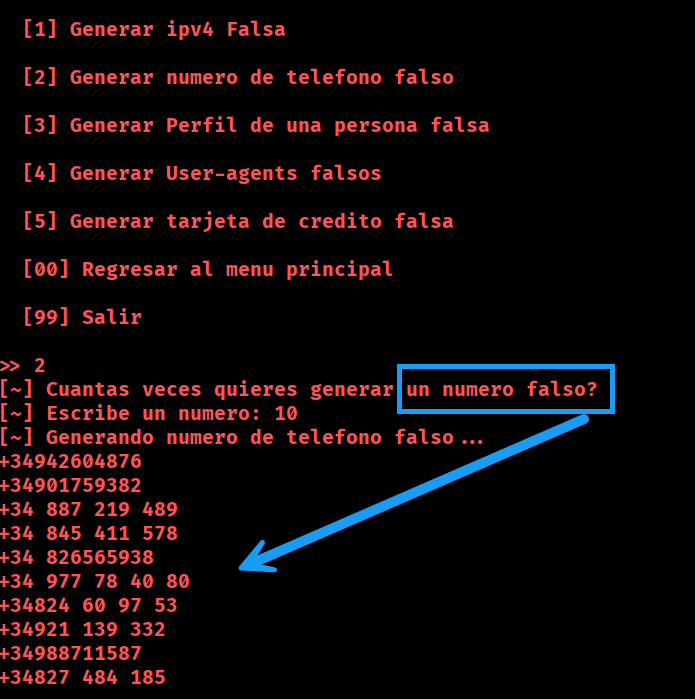
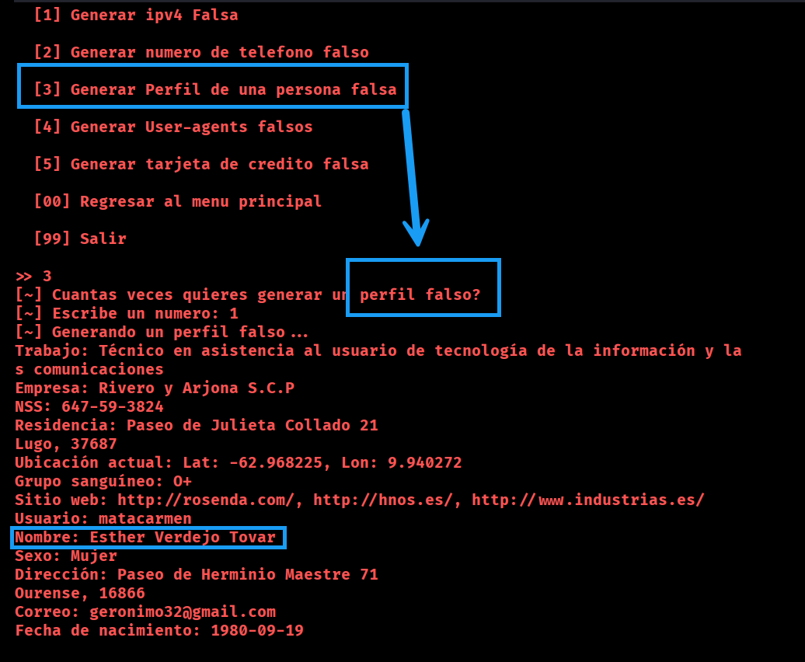
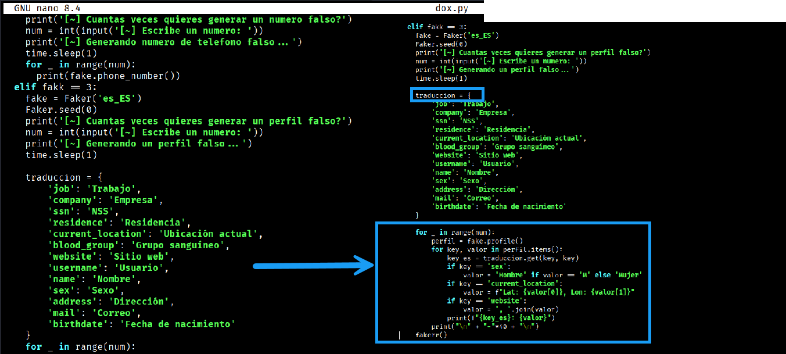

````markdown
# 🔧 Modificación Doxxer-Toolkit (Generación en Español)

Esta carpeta contiene una **modificación del archivo `dox.py`** del proyecto original [Doxxer-Toolkit](https://github.com/Euronymou5/Doxxer-Toolkit), con el objetivo de mejorar la generación de datos falsos en **español**.

⚠️ Importante: Este archivo **sustituye al original `dox.py`**, añadiendo las siguientes mejoras:

1. ✅ Generación de **números móviles españoles válidos** (+34 con prefijo 6 o 7).  
2. ✅ Creación de **perfiles falsos completos en español**, con campos traducidos: `Trabajo`, `Empresa`, `Dirección`, `Correo`, etc.  

---

## 📌 Cómo aplicar la modificación

1. Clona el repositorio original:  
   ```bash
   git clone https://github.com/Euronymou5/Doxxer-Toolkit
   cd Doxxer-Toolkit
````

2. Descarga este `dox.py` modificado y reemplaza el original:

   ```bash
   wget https://github.com/tu_usuario/tu_repo/blob/main/Scripts/dox/dox.py -O dox.py
   ```

3. Instala dependencias (si no las tienes ya):

   ```bash
   pip install faker
   ```

4. Ejecuta normalmente el script:

   ```bash
   python3 dox.py
   ```

---

## 🛠 Ejemplo de uso

* **Opción 2** → Generará números móviles válidos (+34 6XXXXXXXX o +34 7XXXXXXXX).
* **Opción 3** → Generará perfiles completos traducidos al español.

---

## 📖 Licencia

Este trabajo es una **modificación educativa** del proyecto original bajo las condiciones de su licencia.

* Proyecto original: **Euronymou5/Doxxer-Toolkit**
* Autor de la modificación: **\D4nYeD**

No pretende sustituir el trabajo original, sino **adaptarlo a entornos hispanohablantes**.

---

## 🚀 Créditos

* **Euronymou5** → Autor original de Doxxer-Toolkit.
* **\D4nYeD** → Adaptación para teléfonos y perfiles en español.

---

## 🖼️ Ejemplos de salida

A continuación se muestran capturas reales tras aplicar la modificación en `dox.py`:

  
*Ejemplo de números válidos en España (+34 6XXXXXXXX / +34 7XXXXXXXX).*

  
*Generación de perfiles falsos con datos en español.*

  
*Menú del toolkit con las opciones modificadas.*

  
*Vista final de un perfil generado con todos los campos traducidos.*


